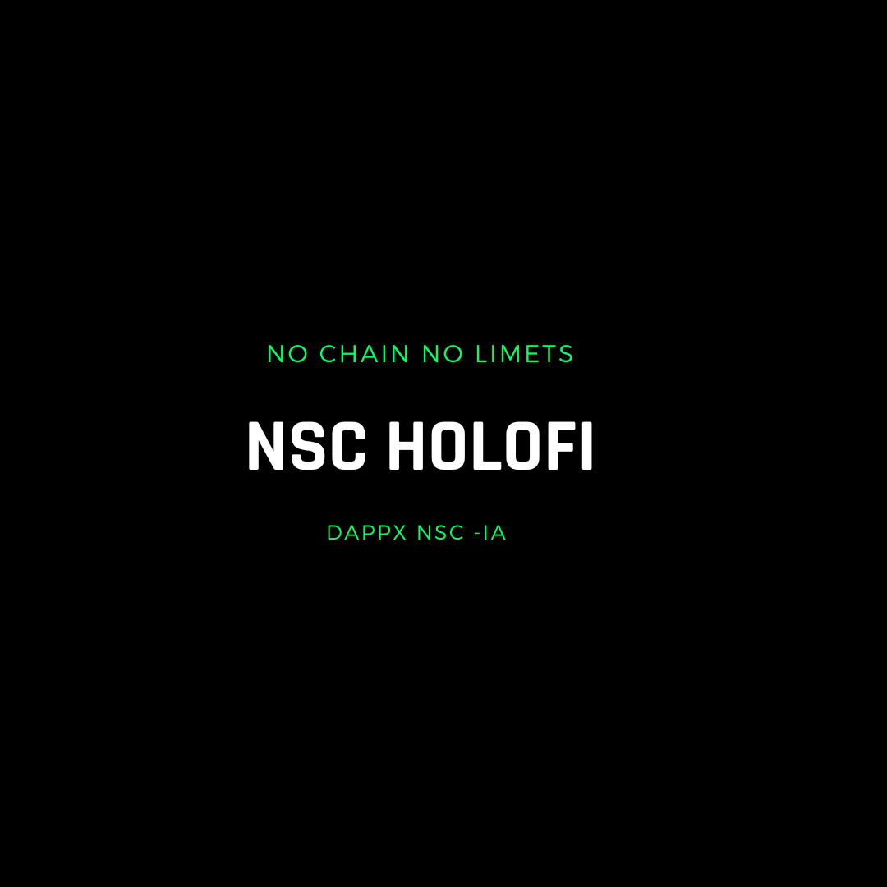

## 🌎 RubyX NSC IA Z 🌎 


### Description

**NSC IA Z** is an advanced HoloFi platform designed to facilitate decentralized applications (DApps) and digital asset management. It integrates a range of cutting-edge technologies to ensure secure and efficient tokenization, transactions, and smart contract operations.

### Key Features

- **Customizable Digital Assets**: Create and manage digital assets on the NSC IA Z HoloFi network.
- **Secure Transfers**: Efficient and secure transfer and verification of digital assets.
- **Planetary Integration**: Advanced functionalities with a focus on Earth and Space integration.
- **Quantum Computing**: Capabilities for hybrid digital asset creation and quantum computing integration.

### Prerequisites

- Lua installed on your machine.
- NSC IA Z client configured and synchronized with the HoloFi network.
- Basic knowledge of Java, TypeScript, RubyX, JavaScript, Shell, SQL, and CMake for smart contract development.
- Internet connection for interaction with the NSC IA Z HoloFi network.

### Usage Instructions

1. **Cloning the Repository:**
   ```sh
   git clone https://github.com/your-username/nsc-ia-z-dapp.git
   ```

2. **Installing Dependencies:**
   ```sh
   cd nsc-ia-z-dapp
   npm install
   ```

3. **Configuring the NSC IA Z HoloFi Network:**
   - Ensure your NSC IA Z client is operational and synced.
   - Set up environment variables in the `.env` file with your NSC IA Z HoloFi network details.

4. **Deploying Smart Contracts:**
   - Compile and deploy smart contracts on the NSC IA Z HoloFi network as required.
   - Update contract addresses in the configuration files (`config.js`, etc.) post-deployment.

5. **Running the DApp:**
   ```sh
   npm start
   ```

6. **Interacting with NSC IA Z DApp:**
   - Utilize provided REST API endpoints to manage digital assets and execute transactions.
   - Digital assets are represented as customizable tokens on the NSC IA Z HoloFi network.

### Planetary Integration

NSC IA Z integrates advanced functionalities with a focus on Earth and Space, enhancing security, transparency, and computational efficiency for DApps.

### Quantum Computing with Hybrid Asset Creation

NSC IA Z integrates innovative solutions for hybrid digital asset creation and quantum computing, pushing the frontiers of decentralized applications and digital asset management.

### New Configurations

- **Updated Environment Configuration**: Ensure to include the latest environment variables related to HORIZON FX and Quantum capabilities in your `.env` file.
- **New Dependencies**: Added support for quantum integration libraries and Horigami FX updates.


NSC IA Z is at the cutting edge of HoloFi technology, providing a robust platform for decentralized applications and digital asset management. With advanced integrations like planetary functionalities and quantum computing capabilities, NSC IA Z is set to redefine the HoloFi landscape.

<p>FOUNDER: LUCAS JANAURIO DO NASCIMENTO</p>



---

Thank you for your attention!

